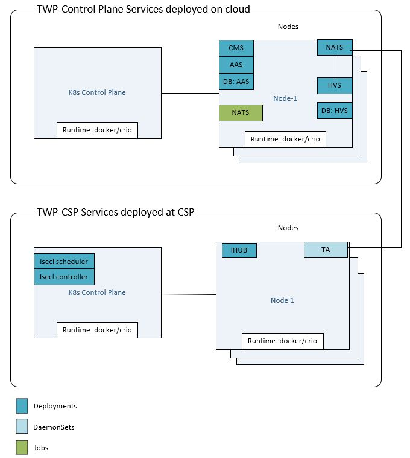

# Helm Chart Deployment steps for Trusted Workload Placement - Cloud Service Provider Usecase

A collection of helm charts for Trusted Workload Placement - Cloud Service Provider Usecase

<!-- @import "[TOC]" {cmd="toc" depthFrom=1 depthTo=6 orderedList=false} -->

<!-- code_chunk_output -->

  - [Getting Started](#getting-started)
    - [Pre-requisites](#pre-requisites)
    - [Support Details](#support-details)
    - [Use Case Helm Charts](#use-case-helm-charts)
    - [Setting up for Helm deployment](#setting-up-for-helm-deployment)
    - [Installing isecl-helm charts](#installing-isecl-helm-charts)
      - [Update `values.yaml` for Use Case chart deployments](#update-valuesyaml-for-use-case-chart-deployments)
      - [Use Case charts Deployment](#usecase-based-chart-deployment-using-umbrella-charts)
      - [Setup task workflow](#setup-task-workflow)

<!-- /code_chunk_output -->

# Deployment diagram


## Getting Started
Below steps guide in the process for installing isecl-helm charts on a kubernetes cluster.

### Pre-requisites
* Non Managed Kubernetes Cluster up and running
* Helm 3 installed
  ```shell
  curl -fsSL -o get_helm.sh https://raw.githubusercontent.com/helm/helm/master/scripts/get-helm-3
  chmod 700 get_helm.sh
  ./get_helm.sh
  ```
* For building container images Refer here for [instructions](https://github.com/intel-secl/docs/blob/v4.2/develop/docs/quick-start-guides/Foundational%20%26%20Workload%20Security%20-%20Containerization/5Build.md)  

* Setup NFS, Refer [instructions](../../docs/NFS-Setup.md) for setting up and configuring NFS Server
  
### Support Details

| Kubernetes        | Details                                                      |
| ----------------- | ------------------------------------------------------------ |
| Cluster OS        | *RedHat Enterprise Linux 8.x* <br/>*Ubuntu 20.04*            |
| Distributions     | Any non-managed K8s cluster                                  |
| Versions          | v1.23                                                        |
| Storage           | NFS                                                          |
| Container Runtime | *CRI-O*<br/>                                                 |

### Use Case Helm Charts 

| Use case                                | Helm Charts                                        |
| --------------------------------------- | -------------------------------------------------- |
| Trusted-Workload-Placement Cloud-Service-Provider  | *ta*<br />*ihub*<br />*isecl-controller*<br />*isecl-scheduler*<br />*admission-controller*<br /> |


### Setting up for Helm deployment

Create a namespace or use the namespace used for helm deployment. 
```kubectl create ns isecl```

##### Create Secrets for ISecL Scheduler TLS Key-pair
ISecl Scheduler runs as https service, therefore it needs TLS Keypair and tls certificate needs to be signed by K8s CA, inorder to have secure communication between K8s base scheduler and ISecl K8s Scheduler.
The creation of TLS keypair is a manual step, which has to be done prior deplolying the helm for Trusted Workload Placement usecase. 
Following are the steps involved in creating tls cert signed by K8s CA.
```shell script
mkdir -p /tmp/k8s-certs/tls-certs && cd /tmp/k8s-certs/tls-certs
openssl req -new -days 365 -newkey rsa:4096 -addext "subjectAltName = DNS:<Controlplane hostname>" -nodes -text -out server.csr -keyout server.key -sha384 -subj "/CN=ISecl Scheduler TLS Certificate"

cat <<EOF | kubectl apply -f -
apiVersion: certificates.k8s.io/v1
kind: CertificateSigningRequest
metadata:
  name: isecl-scheduler.isecl
spec:
  request: $(cat server.csr | base64 | tr -d '\n')
  signerName: kubernetes.io/kube-apiserver-client
  usages:
  - client auth
EOF

kubectl certificate approve isecl-scheduler.isecl
kubectl get csr isecl-scheduler.isecl -o jsonpath='{.status.certificate}' \
    | base64 --decode > server.crt
kubectl create secret tls isecl-scheduler-certs --cert=/tmp/k8s-certs/tls-certs/server.crt --key=/tmp/k8s-certs/tls-certs/server.key -n isecl
```

*Note*: CSR needs to be deleted if we want to regenerate isecl-scheduler-certs secret with command `kubectl delete csr isecl-scheduler.isecl`

##### Create Secrets for Admission controller TLS Key-pair
Create admission-controller-certs secrets for admission controller deployment
```shell script
mkdir -p /tmp/adm-certs/tls-certs && cd /tmp/adm-certs/tls-certs
openssl req -new -days 365 -newkey rsa:4096 -addext "subjectAltName = DNS:admission-controller.isecl.svc" -nodes -text -out server.csr -keyout server.key -sha384 -subj "/CN=system:node:<nodename>;/O=system:nodes"

cat <<EOF | kubectl apply -f -
apiVersion: certificates.k8s.io/v1
kind: CertificateSigningRequest
metadata:
  name: admission-controller.isecl
spec:
  groups:
  - system:authenticated
  request: $(cat server.csr | base64 | tr -d '\n')
  signerName: kubernetes.io/kubelet-serving
  usages:
  - digital signature
  - key encipherment
  - server auth
EOF

kubectl certificate approve admission-controller.isecl
kubectl get csr admission-controller.isecl -o jsonpath='{.status.certificate}' \
    | base64 --decode > server.crt
kubectl create secret tls admission-controller-certs --cert=/tmp/adm-certs/tls-certs/server.crt --key=/tmp/adm-certs/tls-certs/server.key -n isecl

```

Generate CA Bundle
```shell script
kubectl config view --raw --minify --flatten -o jsonpath='{.clusters[].cluster.certificate-authority-data}'
```
Add the output base64 encoded string to value in caBundle sub field of admission-controller in usecase/trusted-workload-placement/values.yml in case of usecase deployment chart.

*Note*: CSR needs to be deleted if we want to regenerate admission-controller-certs secret with command `kubectl delete csr admission-controller.isecl` 

### Installing isecl-helm charts

* Add the chart repository
```shell script
helm repo add isecl-helm https://intel-secl.github.io/helm-charts
helm repo update
```

* To find list of available charts
```shell script
helm search repo --versions
```

### Usecase based chart deployment (using umbrella charts)

#### Update `values.yaml` for Use Case chart deployments

Some assumptions before updating the `values.yaml` are as follows:
* The images are built on the build machine and images are pushed to a registry tagged with `release_version`(e.g:v5.0.0) as version for each image
* The NFS server setup is done either using sample script [instructions](../../docs/NFS-Setup.md) or by the user itself
* The K8s non-managed cluster is up and running
* Helm 3 is installed

The helm chart support Nodeports for services to support ingress model, enable the ingress by setting the value ingress enabled to true in values.yaml file.

Update the ```hvsUrl, cmsUrl and aasUrl``` under global section according to the conifgured model.
e.g For ingress. hvsUrl: https://hvs.isecl.com/hvs/v2
    For Nodeport, hvsUrl: https://<controlplane-hosntam/IP>:30443/hvs/v2

#### Use Case charts Deployment

```shell script
export VERSION=v5.0.0
helm pull isecl-helm/Trusted-Workload-Placement-Cloud-Service-Provider  --version $VERSION && tar -xzf Trusted-Workload-Placement-Cloud-Service-Provider -$VERSION.tgz Trusted-Workload-Placement-Cloud-Service-Provider/values.yaml
helm install <helm release name> isecl-helm/Trusted-Workload-Placement-Cloud-Service-Provider  --version $VERSION -f Trusted-Workload-Placement-Cloud-Service-Provider/values.yaml --create-namespace -n <namespace>
```

> **Note:** If using a separate .kubeconfig file, ensure to provide the path using `--kubeconfig <.kubeconfig path>`

#### Configure kube-scheduler to establish communication with isecl-scheduler after successful deployment.
Refer [instructions](../../docs/ISecl-Scheduler-Configuration.md) for configuring kube-scheduler to establish communication with isecl-scheduler

## Setup task workflow.
* Refer [instructions](../../docs/setup-task-workflow.md) for running service specific setup tasks

To uninstall a chart
```shell script
helm uninstall <release-name> -n <namespace>
```

To list all the helm chart deployments 
```shell script
helm list -A
```

Cleanup steps that needs to be done for a fresh deployment
* Uninstall all the chart deployments
* Cleanup the data at NFS mount and trustagent data mount on each nodes (/etc/trustagent, /var/log/trustagent)
* cleanup the secrets for isecl-scheduler-certs and admission-controller-certs. ```kubectl delete secret -n <namespace> isecl-scheduler-certs admission-controller-certs```
* Remove all objects(secrets, rbac, clusterrole, service account) related namespace related to deployment ```kubectl delete ns <namespace>```. 

**Note**: 
    
    Before redeploying any of the chart please check the pv and pvc of corresponding deployments are removed. Suppose
    if you want to redeploy aas, make sure that aas-logs-pv, aas-logs-pvc, aas-config-pv, aas-config-pvc, aas-db-pv, aas-db-pvc, aas-base-pvc are removed successfully.
    Command: ```kubectl get pvc -n <namespace>``` && ```kubectl get pv -n <namespace>```
